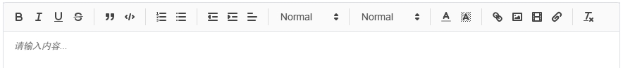
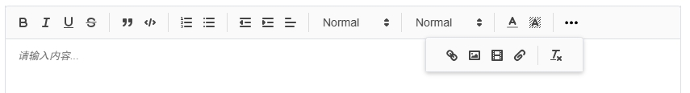
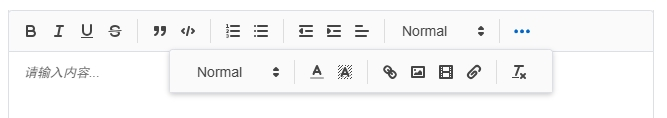

# Responsive child element





## Usage
```javascript
import ResponsiveChild from 'resi-child'
import moreIcon from './icon/more.svg?raw'

new ResponsiveChild(document.querySelector('#toolbar'), {
  buttonTextMore: moreIcon,
  popover: true
})
```

## Options
```javascript
{
  buttonTextMore: 'More',
  buttonTextLess: 'Less',
  buttonClass: 'responsive-button',
  collapsedClass: 'collapsed',
  popover: false,
  clone: false,
  popoverWrapClass: 'responsive-popover-wrap',
  popoverWrapStyle: `
position: absolute;
visibility: hidden;
height: 0;
z-index: 1000;
background: #fff;
box-shadow: 0 2px 5px rgba(0,0,0,0.2);`,
  popoverClass: 'responsive-popover',
  popoverStyle: `
padding: 10px;
width: auto;
width: fit-content;`,
  popoverContainer: document.body,
  hiddenClass: 'responsive-hide'
}
```
